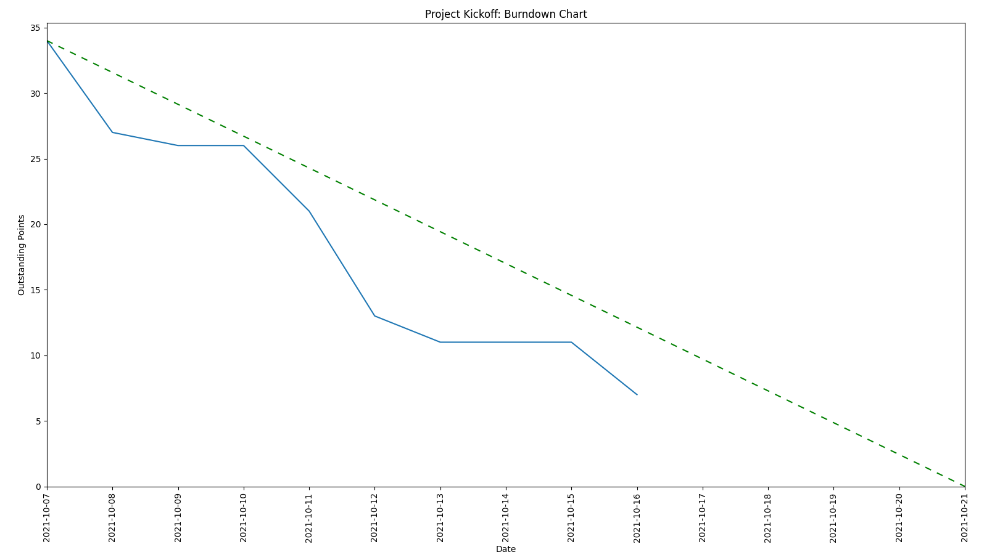

# Burndown Chart for GitHub Projects
An easy to use [burndown chart](https://www.scrum.org/resources/scrum-glossary#:~:text=B-,burn-down%20chart,-%3A%C2%A0a%20chart%20which) generator for [GitHub Project Boards](https://docs.github.com/en/issues/organizing-your-work-with-project-boards/managing-project-boards/about-project-boards).

<!-- BADGES -->
[](https://github.com/thehale/github-projects-burndown-chart/blob/master/LICENSE)
[](https://github.com/sponsors/thehale)
[![Joseph Hale's software engineering blog](https://img.shields.io/badge/jhale.dev-black.svg?style=plastic&logo=data:image/svg+xml;base64,PHN2ZyB3aWR0aD0iNCIgaGVpZ2h0PSI0IiB2aWV3Qm94PSIwIDAgMS4wNTggMS4wNTgiIHhtbG5zPSJodHRwOi8vd3d3LnczLm9yZy8yMDAwL3N2ZyI+PGcgY29sb3I9IiMwMDAiIHBhaW50LW9yZGVyPSJmaWxsIG1hcmtlcnMgc3Ryb2tlIj48cGF0aCBkPSJNLjY0My43NTJhLjE1Ni4xNTYgMCAwMC0uMTMuMDU5Qy40NzYuODUuNDcuOTE3LjQ2OS45M2EuMDI1LjAyNSAwIDAwLjAyNi4wMjhoLjA2NmEuMDI1LjAyNSAwIDAwLjAyNC0uMDIuMTIuMTIgMCAwMS4wMi0uMDUyQy42MTguODcuNjMyLjg2OS42NTUuODY5aC4xMjJjMC0uMDAyLjA3Ni4wMDcuMTI5LS4wNUEuMTQzLjE0MyAwIDAwLjkyOC43ODcuMDI1LjAyNSAwIDAwLjkwNi43NTJILjY0M3oiIGZpbGw9IiMwNTAiLz48cGF0aCBkPSJNLjM5My40MWEuMDIuMDIgMCAwMC0uMDIuMDJ2LjI2YzAgLjAxMi4wMDEuMDI5LS4wMTQuMDQ0Qy4zMy43NTkuMjgyLjc1LjI2Ny43MzYuMjU3LjcyOC4yNS43MTMuMjQ0LjY4N0EuMDI1LjAyNSAwIDAwLjIyLjY3SC4xNTNhLjAyNC4wMjQgMCAwMC0uMDI1LjAyNmMuMDA0LjA1Mi4wMjUuMDkuMDUxLjExOWEuMTY3LjE2NyAwIDAwLjExMy4wNTJoLjAzNWEuMTg0LjE4NCAwIDAwLjExNS0uMDVBLjE4Mi4xODIgMCAwMC40OS42OTRWLjQzMUEuMDIuMDIgMCAwMC40Ny40MXpNLjc4Ny4zOWEuMDIuMDIgMCAwMC0uMDIuMDJ2LjI0MmMwIC4wMTEuMDA5LjAyLjAyLjAyaC4wNzdhLjAyLjAyIDAgMDAuMDItLjAyVi40MTFhLjAyLjAyIDAgMDAtLjAyLS4wMnpNLjM5My4yMThhLjAyLjAyIDAgMDAtLjAyLjAydi4wNzdjMCAuMDExLjAwOC4wMi4wMi4wMkguNDdhLjAyLjAyIDAgMDAuMDItLjAyVi4yMzhhLjAyLjAyIDAgMDAtLjAyLS4wMnpNLjU5LjFhLjAyLjAyIDAgMDAtLjAyLjAydi41MzJjMCAuMDExLjAwOS4wMi4wMi4wMmguMDc3YS4wMi4wMiAwIDAwLjAyLS4wMlYuMTJBLjAyLjAyIDAgMDAuNjY3LjF6IiBmaWxsPSIjMDBkNDAwIi8+PC9nPjwvc3ZnPg==)](https://jhale.dev)
[](https://www.linkedin.com/comm/mynetwork/discovery-see-all?usecase=PEOPLE_FOLLOWS&followMember=thehale)



## Table of Contents
* [Features](#features)
* [Installation](#installation)
* [Assumptions](#assumptions)
* [Configuration](#configuration)
* [Usage](#usage)
* [Contributing](#contributing)
* [About](#about)

## Features
* Create a **burndown chart for a GitHub Project Board**.
* Works for projects in **public/private repositories** and **organizations**.
* Includes a **trend line** for the current sprint.
* Supports custom labels for **tracking points for issues**

## Assumptions
This tool, while flexible, makes the following assumptions about your project management workflow:
* You use one and only one [GitHub Project Board](https://docs.github.com/en/issues/organizing-your-work-with-project-boards/managing-project-boards/about-project-boards) for each of your [Sprints](https://scrumguides.org/scrum-guide.html#the-sprint)
* You use one and only one [GitHub Milestone](https://docs.github.com/en/issues/using-labels-and-milestones-to-track-work/about-milestones) for each of your [User Stories](https://www.scrum.org/resources/blog/user-story-or-stakeholder-story)
* You use one and only one [GitHub Issue](https://docs.github.com/en/issues/tracking-your-work-with-issues/about-issues) for each of your [Sprint Backlog Items/Tasks](https://scrumguides.org/scrum-guide.html#sprint-backlog)
* If you want to track points, each of your GitHub Issues has a [label](https://docs.github.com/en/issues/using-labels-and-milestones-to-track-work/managing-labels) indicating how many [points](https://www.scrum.org/resources/scrum-glossary#:~:text=several%20ways%20such%20as-,user%20story%20points,-or%20task%20hours.%20Work) its corresponding task is worth.
    - Furthermore, all labels that indicate point values have the format `<prefix><int>`.
    - Multiple labels indicating points on the same Issue are supported.
* A Sprint Backlog Task is considered [Done](https://www.scrum.org/resources/professional-scrum-developer-glossary#:~:text=D-,definition%20of%20done%3A,-a%20shared%20understanding) if its corresponding GitHub Issue is Closed.

## Installation
### 0. Clone this repository
```
git clone https://github.com/thehale/github-projects-burndown-chart.git
cd github-projects-burndown-chart
```
### 1. Create a virtual environment
```
python -m venv ./venv
```

### 2. Activate the virtual environment

*Linux/macOS*
```
source venv/bin/activate
```
*Windows (Powershell)*
```
.\venv\Scripts\activate
```
*Windows (Command Prompt)*
```
.\venv\Scripts\activate.bat
```

### 3. Install the dependencies
```
pip install -r requirements.txt
```

## Configuration
### 1. Create a [Personal Access Token](https://github.com/settings/tokens) with the `repo` scope. If Project V2, add `read:project` scope.
Do not share this token with anyone! It gives the bearer full control over all private repositories you have access to!

This is required to pull the Project Board data from GitHub's GraphQL API.
### 2. Make a copy of `src/github_projects_burndown_chart/config/secrets.json.dist` without the `.dist` ending.
This allows the `.gitignore` to exclude your `secrets.json` from being accidentally committed.
### 3. Fill out the `github_token` with your newly created Personal Access Token.
### 4. Make a copy of `src/github_projects_burndown_chart/config/config.json.dist` without the `.dist` ending.
This allows the `.gitignore` to exclude your `config.json` from being accidentally committed.
### 5. Fill out all the configuration settings
#### Repository Projects
`project_name`: A memorable name for your project for use with this tool.

`project_name.query_variables`
| Variable | Meaning |
|----------|---------|
| `repo_owner` | The username of the owner of the repo. <br/><br/> Example: `thehale` |
| `repo_name` | The name of the repo. <br/><br/> Example: `github-projects-burndown-chart`|
| `project_number` | The ID of the project for which you want to generate a burndown chart. This is found in the URL when looking at the project board on GitHub. <br/><br/> Example: `1` (from [`https://github.com/thehale/github-projects-burndown-chart/projects/1`](https://github.com/thehale/github-projects-burndown-chart/projects/1)) |
| `column_count` | A number >= the number of columns on the project board. (DEFAULT: 5)<br/><br/> A closer fit improves performance and reduces the chance of rate limiting from GitHub's GraphQL API. If Project V2, it is optional. |
| `max_cards_per_column_count` | A number >= the maximum number of cards in any column on the project board. (DEFAULT: 50)<br/><br/> A closer fit improves performance and reduces the chance of rate limiting from GitHub's GraphQL API. If Project V2, it is optional. |
| `labels_per_issue_count` | A number >= the number of labels on any issue on project board. (DEFAULT: 5)<br/><br/> A closer fit improves performance and reduces the chance of rate limiting from GitHub's GraphQL API. |

`project_name.settings`
| Variable | Meaning |
|----------|---------|
| `sprint_start_date` | The first day of the sprint formatted as `YYYY-MM-DD`. <br/><br/> Must be entered here since GitHub Project Boards don't have an assigned start/end date. <br/><br/> Example: `2021-10-08` |
| `sprint_end_date` | The last day of the sprint formatted as `YYYY-MM-DD`. <br/><br/> Must be entered here since GitHub Project Boards don't have an assigned start/end date. <br/><br/> Example: `2021-10-21` |
| `chart_end_date` | (OPTIONAL) The last day to show on the burndown chart formatted as `YYYY-MM-DD`. <br/><br/> Used to change the end date of the chart without affecting the slope of the ideal burndown line (e.g. to show tasks that were completed after the official end of a sprint). <br/><br/> Example: `2021-10-24` |
| `points_label` | (OPTIONAL) The prefix for issue labels containing the point value of the issue. Removing this prefix must leave just an integer. If set to `null`, the burndown chart will count open issues instead of points.<br/><br/> Example: `Points: ` (with the space) |
| `calculators` | (OPTIONAL) A list of the calculator(s) to use to calculate the point burndown lines to show on the burndown chart. (DEFAULT: [`closed`])<br/><br/>_OPTIONS:_ `closed`, `assigned`, `created`, `taiga`<br/><br/> Example: [`taiga`, `closed`, `assigned`] |
| `version` | (OPTIONAL) The version number of GitHub Projects to use the burndown chart. (DEFAULT: [`1`])<br/><br/> OPTIONS: `1`, `2`<br/><br/> Example: `2` |

#### Organization Projects
All settings are the same as for the [Repository Projects](#repository-projects), except `repo_owner` and `repo_name` are replaced with `organization_name` as shown below.

`project_name.query_variables`
| Variable | Meaning |
|----------|---------|
| `organization_name` | The name of the organization on GitHub as it appears in the URL of their organization page. <br/><br/> Example: `golang` (from https://github.com/golang) |
## Usage
Given that `PROJECT_TYPE` is one of `[repository, organization]` and `PROJECT_NAME` matches a key in the `config.json` under the chosen `PROJECT_TYPE`, run the following command:
```
make run type=PROJECT_TYPE name=PROJECT_NAME
```

This will pop up an interactive window containing the burndown chart, including a button for saving it as a picture.

### Example
Make a copy of `example.config.json` without the leading `example.`

To see this repository's example project board:
```
make run type=repository name=burndown_chart_kickoff
```

To see Golang's progress on their current roadmap:
```
make run type=organization name=golang_on_deck
```

### Discord Webhook
This project also supports posting the burndown chart to a Discord Webhook. Here's how to set that up:
1. [Create a webhook](https://support.discord.com/hc/en-us/articles/228383668-Intro-to-Webhooks#:~:text=Facebook-,making%20a%20webhook,-With%20that%20in) in your Discord server.
2. Put the webhook's URL into the `discord_webhook` setting in `secrets.json`.
3. Add the `--discord` option when running the script.

```
make run type=repository name=burndown_chart_kickoff opts="--discord"
```

### Save as file
This project also supports saving the burndown chart file. Here's how to set that up:
1. Add the `--filepath=$filepath` option when running the script.

```
make run type=repository name=burndown_chart_kickoff opts="--filepath=./tmp/chart.png"
```

## Contributing
Contributions are welcome via a [Pull Request](https://docs.github.com/en/github/collaborating-with-pull-requests/proposing-changes-to-your-work-with-pull-requests/creating-a-pull-request).

*The Legal Part*

By submitting a contribution, you are agreeing that the full contents of your contribution will be subject to the license terms governing this repository, and you are affirming that you have the legal right to subject your contribution to these terms.

## About
This project was first created by Joseph Hale (@thehale) and Jacob Janes (@jgjanes) to facilitate their coursework in the BS Software Engineering degree program at Arizona State University.

We hope it will be especially useful to other students in computing-related fields.
